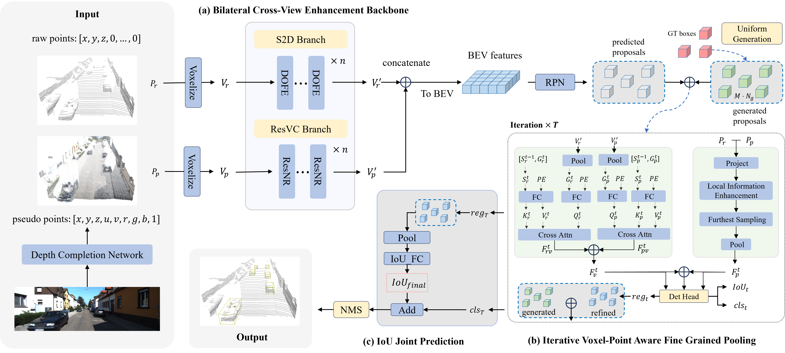

# CMF-IOU

It is the official code release of [CMF-IOU (TCSVT 2025)](). We design a multistage cross-modal fusion 3D detection framework, termed CMF-IOU, to effectively address the challenge of aligning 3D spatial and 2D semantic information. The code is based on [OpenPCDet](https://github.com/open-mmlab/OpenPCDet).

## Framework

Overview of our CMF-IOU framework. We estimate the pseudo points by a depth completion network and integrate them with the LiDAR points as
our input. (a) The bilateral cross-view enhancement backbone contains the S2D branch and the ResVC branch, where the S2D branch encodes the raw voxel
features and the ResVC branch encodes the pseudo voxel features. (b) The iterative voxel-point aware fine grained pooling is designed for optimizing the
predicted and generated proposals. (c) The IoU joint prediction balances the IoU and classification scores in the NMS post-processing stage.


## Getting Started
```
conda create -n cmfiou python=3.9
conda activate cmfiou
pip install -r requirements.txt
python setup.py develop

cd tools & bash run_cmfiou_kitti.sh
```

## Dataset Preparation
We generate the pseudo points via the depth completion model [PENet](https://arxiv.org/abs/2103.00783) and [MVP](https://arxiv.org/abs/2111.06881).

### Results on KITTI validation dataset (mAP)
| Category | 3D_Easy | 3D_Mod | 3D_Hard | BEV_Easy | BEV_Mod | BEV_Hard | Config |
|:-----:|:-----:|:-----:|:-----:|:-----:|:-----:|:-----:|:-----:|
| Car | 91.92 | 85.14 | 80.63 | 95.72 | 92.07 | 87.25 | [CMF-IOU-MM.yaml](./tools/cfgs/models/kitti/CMF-IOU-MM.yaml) |
| Pedestrain | 53.26 | 49.23 | 46.19 | 58.62 | 52.48 | 50.31 | [CMF-IOU-MM.yaml](./tools/cfgs/models/kitti/CMF-IOU-MM.yaml) |
| Cyclist | 85.56 | 71.84 | 63.43 | 87.21 | 72.87 | 66.85 | [CMF-IOU-MM.yaml](./tools/cfgs/models/kitti/CMF-IOU-MM.yaml) |

## TODO
* [ ] Add the results in the nuScenes and Waymo datasets.
* [ ] Add the details of the pseudo point clouds generation.
* [ ] Add the weights or checkpoints of our model.

<!-- ## FAQ -->

<!-- - Since we rebuilt and unified the codebase for all datasets, the model accuracy of HEDNet and SAFDNet is slightly lower than the results released in the paper (by at most 0.3\% L2 mAPH on Waymo Open). You can run the previous branch ``HEDNet`` to get better results. We are trying to fix the gap and will update the code as soon as possible. -->
<!-- - Release the model checkpoints on nuScenes and Argoverse2 datasets. -->

<!-- ## Citation
```
@inproceedings{zhang2023hednet,
  title={{HEDNet}: A Hierarchical Encoder-Decoder Network for 3D Object Detection in Point Clouds},
  author={Zhang, Gang and Chen, Junnan and Gao, Guohuan and Li, Jianmin and Hu, Xiaolin},
  booktitle={Thirty-seventh Conference on Neural Information Processing Systems (NeurIPS)},
  year={2023},
}
``` -->

## Acknowleadgement
This work is partially supported by National Natural Science Foundation of China (Grant No. 62376153, 62402318, 24Z990200676, 62271237, U24A20220，62132006，62311530101) and Science Foundation of the Jiangxi Province of China (Grant No. 20242BAB26014).
